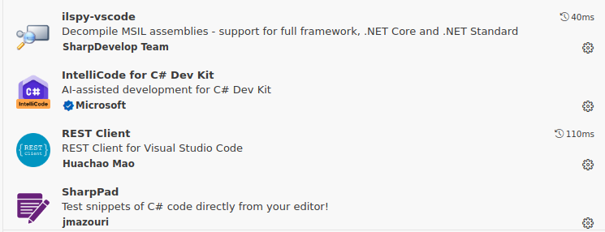

# EF
## Instal·lació / Actualització SDK

https://learn.microsoft.com/en-us/dotnet/core/install/linux-debian?tabs=dotnet9#debian-12


## Instal·lació / Actualització EF

```bash
dotnet tool install --global dotnet-ef
```

## Tipus d'aplicació

* Web application
* Desktop application
* Console application 

# Visual Studio Code
## Extensions


